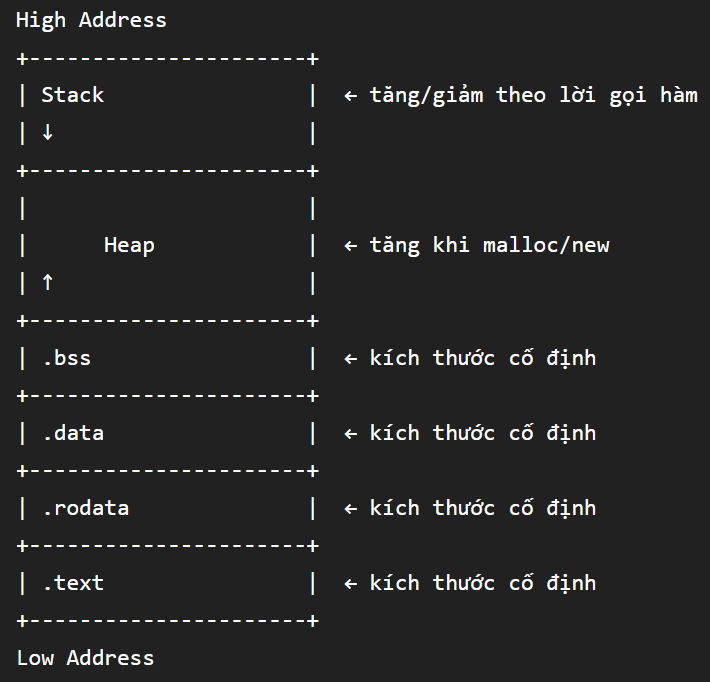

# Bài 1: Lỗi bộ nhớ: Những vấn đề ở mức cao
1. Sự tin tưởng của developer
Mình lấy một ví dụ về sự khác nhau về quản lý bộ nhớ giữa ngôn ngữ lập trình bậc cao(python) và ngôn ngữ lập trình bậc thấp(C):
Trong python: 
```python
    a[3]={1,2,3}
    a[5]=2
    print(a[5])
```

Trong C:
```c
    a[3]={1,2,3};
    a[5]=2;
    printf("%d",a[5]);
```

Khi đoạn code trên được chạy, bạn sẽ thấy đối với python sẽ có thông báo lỗi trở về khi truy cập vào index nằm ngoài kích thước của mảng a. Tuy nhiên, C trả về kết quả là 2 tại index là 5 cho dù mảng a gồm có 3 phần tử. Suy ra, đối với từng ngôn ngữ lập trình sẽ có nhiều cách quản lý bộ nhớ khác nhau, nếu developer chủ quan có thể dẫn đến các lỗ hổng nghiêm trọng như: ghi đè dữ liệu, tràn ngăn nhớ,...

2. Dữ liệu và thông tin điều khiển bị trộn lẫn
Trước khi tìm hiểu nguyên nhân này thì bạn cần phải biết về " Hệ thống nhớ gồm những thành phần nào ?"
- Hệ thống nhớ gồm 6 phân vùng chính:

+ Stack: Vùng chứa biến cục bộ, tham số truyền vào hàm và địa chỉ trả về để biết quay lại đâu khi kết thúc hàm.
+ Heap: Vùng chứa dữ liệu được cấp phát động trong lúc chương trình đang chạy
+ .bss: Vùng chứa biến toàn cục và biến tĩnh chưa được khởi tạo 
+ .data: Vùng chứa các biến toàn cục và biến tĩnh đã được gán giá trị ban đầu khác 0. Ngoài ra còn .rodata là vùng chứa các giá trị hằng số mà chương trình không cho phép sửa đổi
+ .text: Vùng chứa mã máy của chương trình đã được biên dịch

Như vậy bạn có thể thấy trong vùng nhớ stack có sự trỗn lẫn giữa thông tin điều khiển (Địa chỉ trả về) và data ( biến cục bộ, tham số truyền vào hàm), vùng nhớ heap cũng chứa thông tin điều kiện(flags, chunk size,..) và data và các có một vài vùng khác cũng như vậy. Hơn nữa, vùng nhớ stack và vùng nhớ heap có sự phát triển ngược chiều nhau trong không gian địa chỉ tiến trình nên 2 vùng nhớ này có thể ghi đè vào nhau gây ra sự nguy hiểm như: ghi đè địa chỉ trả về hàm khác, thay đổi giá trị của các biến.
Khi kiểm soát được thông tin điều khiển thì mã có thể ghi đè vào vùng .text, nó sẽ dẫn tới việc gián tiếp thay đổi luồng điều khiển chương trình hoặc inject code tùy ý.

3. Metadata và dữ liệu bị trộn lẫn
Mình minh họa 1 như sau: Null byte(\0) trong chuỗi được coi là thông tin mô tả chuỗi . Một số các hàm xử lí chuỗi đều dựa vào null byte để xác định điểm kết thúc của chuỗi. Do đó, khi một biến chứa một chuỗi "tu\0ng" chứa kí tự null byte(\0) các hàm như read, strlen sẽ xử lí và đếm sai số lượng kí tự là 2 thay vì 5
4. Khởi tạo và dọn dẹp
Nếu không dọn dẹp các biến sau khi sự dụng thì C sẽ không có cơ chế tự động dọn dẹp. từ đó khi khai báo 1 biến chưa gán giá trị ban đầu, nó sẽ chứa giá trị rác. Gía trị rác này được hiểu có thể là giá trị của biến nào đó trước đó tại địa chỉ đó. Điều này có thể dẫn tới việc lộ thông tin nhạy cảm

# Bài 2: Lỗi bộ nhớ: Ghi tràn ngăn nhớ 
1. Tràn bộ đệm (cơ bản)
Ví dụ:
```c
    int main(int argc, char **argv, char **envp)
    {
        char buffer[5];
        read(0,buffer,128)
    }
```
Nhìn qua đoạn code trên mảng buffer có size là 5 nhưng hàm read lại cho phép ghi tối đa 128 byte dữ liệu vào mảng buffer điều này có thể dẫn đến việc ghi đè vào giá trị trả về trên stack và có thể gọi function khác
2. Nhầm lẫn giữa số có dấu và số không dấu
Theo quy ước của thư viện C thì các hàm thao tác bộ nhớ như read, memcpy, strncpy luôn dùng kiểu số không dấu cho tham số độ dài. Vì độ dài không thể âm. Vấn đề xảy ra khi khai báo size là kiểu số nguyên mặc định như int, short, long vì đây là các kiểu có dấu.
Số nguyên có không dấu có giá trị hex [0x00000000,0xFFFFFFFF]
Số nguyên có dấu có giá trị hex [0x80000000,0x7FFFFFFF]
Có 2 điều cần chú ý là : 
- Số nguyên có dấu được biểu diễn bằng phương pháp bù 2 nên 0xFFFFFFFF biểu diễn số có dấu là -1 nhưng số không dấu là 4294967295.
- Sự khác nhau giữa số có dấu và không dấu thực chất phụ thuộc vào lệnh nhảy điều khiển trong assembly.

Ví dụ: 
```c
    int main()
    {
        int size;
        char buffer[16];
        scanf("%i",&size);
        if (size>16) exit(1);
        read(0,buf,size);
    }
```
Trong ví dụ này chương trình có kiểm tra nếu size > 16 thì thoát chương trình. Tuy nhiên vì size là kiểu int nên khi biên dịch lệnh nhảy sẽ là jge (có dấu). Bạn có thể nhập -1 >16 => bypass. Tới hàm read thì hàm này lại xử lí size là số không dấu nên giá trị size=-1 sẽ bị ép thành 4294967295. Kết quả là hàm read đọc tới 4GB dữ liệu ghi vào mảng buffer => Stack overflow.

3. Tràn số nguyên
Ví dụ: 
```c
    int man()
    {
        unsigned int size;
        scanf("%i",&size);
        char *buffer=alloca(size+1);
        int n= read(0, buffer, size);
        buffer[n]='\0';
    }
```
Đoạn code trên thực hiện nhập kích thước cho mảng buffer sau đó ghi dữ liệu từ bàn phím vào buffer rồi gán giá trị cuối cùng trong mảng là kí tự kết thúc chuỗi '\0'.
Việc tràn số nguyên xảy ra khi nhập giá trị 4294967295 (0xFFFFFFFF). Để giải thích điều này thì mình sẽ phân tích từng dòng code với đầu vào 4294967295.
Đầu tiên hàm alloca() cấp phát bộ nhớ (size+1) byte cho mảng buffer. Vì size hiện tại là giá trị max của 32bit nên khi cộng thêm 1 nó sẽ bị quay vòng về 0 (0x00000000) => mảng buffer đc cấp phát 0 byte.
Khi hàm read được thực thi nó sẽ đọc dữ liệu tối đa size bytes từ bàn phím vào mảng buffer. Do size là 4294967295 nhưng mảng buffer có kích thước là 0 byte v=> Stack overflow
4. Off-by-one 
Lỗi off-by-one xảy ra khi vòng lặp lặp quá nhiều hoặc thiếu đúng 1 lần so với số phần tử thực tế của mảng.
Ví dụ:
```c
    int a[3]={1,2,3};
    for (int i=0; i<=3;i++) a[i]=0;
```
Mảng a chỉ có 3 phần tử nhưng vòng lặp lại chạy tới phần tử thứ 4 điều này sẽ khiến vùng nhớ nằm ngay sau mảng a trên stack bị ghi đè 1 byte=> Stack overflow.

