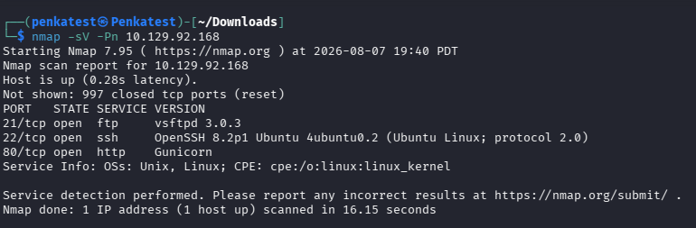
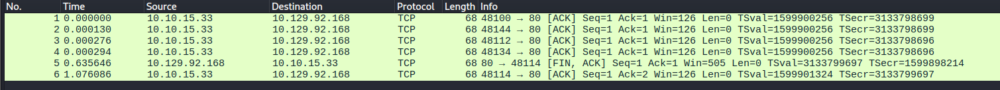
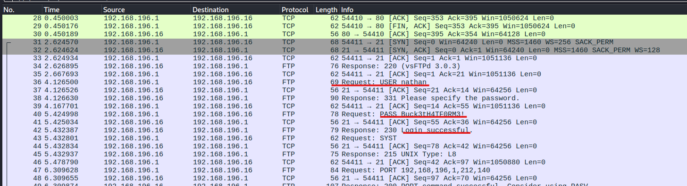
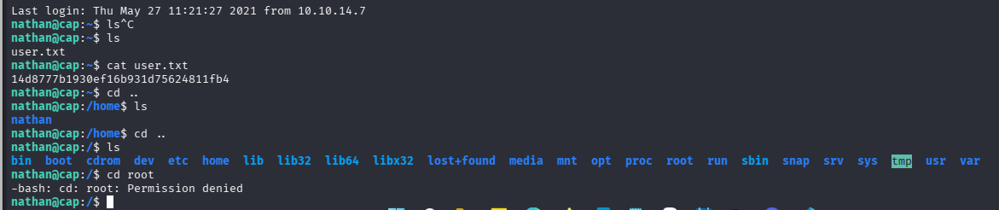
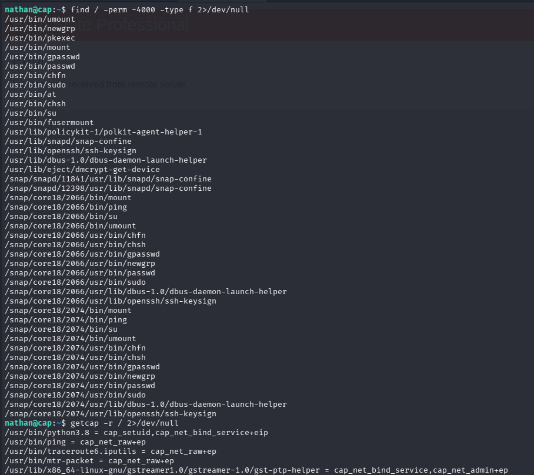
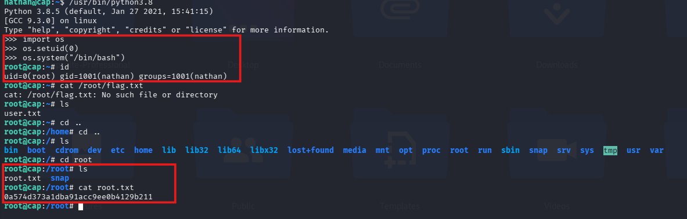

# Tổng quan
Mức độ: Easy\
Mô tả: Cap is an easy difficulty Linux machine running an HTTP server that performs administrative functions including performing network captures. Improper controls result in Insecure Direct Object Reference (IDOR) giving access to another user's capture. The capture contains plaintext credentials and can be used to gain foothold. A Linux capability is then leveraged to escalate to root.
# Thu thập thông tin
Thực hiện dò quét các cổng và dịch vụ trên IP target.

```text
nmap -sV -Pn <IP_Machine> 
```

Kết quả cho thấy những ports và service:
- Port 21/tcp đang chạy service ftp version vsftpd 3.0.3
- Port 22/tcp đang chạy service ssh version OpenSSH 8.2p1  trên Ubuntu
- Port 80/tcp đang chạy service http version Gunicorn

Tìm kiếm các endpoint trên service http bằng gobuster:
```text
gobuster dir --url <IP:PORT> -w /usr/share/wordlist/dirb/common.txt 
```
Từ kết quả trả về trên và test các chức năng thủ công trên web mình phát hiện các endpoints gồm `/ip`,`/netstat`,`/data/{id}`,`/?search=`,`/capture`
# Phân tích và khai thác lỗ hổng
Các chức năng của từng endpoints bao gồm:
- `/ip`: Đưa thông tin về card/interface mạng của máy
- `/netstat`: Đưa ra thông tin về kết nối mạng và socket đang hoạt động trên máy
- `/?search=`: Thực hiện tìm kiếm thông tin trên dashboard
- `/capture`: Endpoints này thực hiện tự động chuyển hướng sang `/data/{id}`
- `/data/{id}`: Cung cấp các file pcap dựa trên id

Qua những thông tin trên, endpoints nhạy cảm nhất là /data/{id} mình có thể truyền các giá trị `id` khác nhau để lấy file pcap của id đó. 


Bên trên là file pcap của `id=2` chỉ là các gói tin xác nhận đã nhận dữ liệu và gói tin yêu cầu đóng kết nối TCP. 

Tiếp đến thực hiện kiểm tra `id=0` vì thường đây là id của administrator hoặc là id chứa thông tin quan trọng.



Bên trên là thông tin về các gói tin TCP, HTTP, FTP. Điều quan trọng nhất là các gói tin FTP với dữ liệu ở bản rõ, tiết lộ req login có `username:nathan` `password: Buck3tH4TF0RM3!`

Vì có username và password nên mình cũng có thể truy cập vào dịch vụ ssh và nhận thấy khi truy cập vào /root thì `-bash: cd: root: Permission denied`. Vì vậy mục tiêu tiếp theo cần nâng quyền hạn của user `nathan`.



Mình sẽ kiểm tra tất cả các `SSUID binaries` và files `capabilities` trên hệ thống:
```text
find / -perm -4000 -type f 2>/dev/null
getcap -r / 2>/dev/null
```


Qua kết quả trả về mình phát hiện có có file `/usr/bin/python3.8` với quyền `cap_setupid, cap_net_bind_service+eip`. Cụ thể với quyền `cap_setupid` cho phép tiến trình có quyền đổi UID. 

Như vậy mình sẽ gọi chương trình python3.8 thực hiện đổi `UID` thành `0` sau đó truy cập `/root/root.txt` để lấy nội dung


# Báo cáo
Các câu hỏi và đáp án của machine:

Q1. How many TCP ports are open?\
Answer: 3

Q2. After running a "Security Snapshot", the browser is redirected to a path of the format /[something]/[id], where [id] represents the id number of the scan. What is the [something]?\
Answer: data

Q3. Are you able to get to other users' scans?\
Answer: yes

Q4. What is the ID of the PCAP file that contains sensative data?\
Answer: 0

Q5. Which application layer protocol in the pcap file can the sensetive data be found in?\
answer: FTP

Q6. We've managed to collect nathan's FTP password. On what other service does this password work?\
Answer: SSH

Q7. Submit the flag located in the nathan user's home directory.\
Answer: 14d8777b1930ef16b931d75624811fb4

Q8. What is the full path to the binary on this machine has special capabilities that can be abused to obtain root privileges?\
Answer: /usr/bin/python3.8

Q9. Submit the flag located in root's home directory.\
Answer: 0a574d373a1dba91acc9ee0b4129b211

Nhận xét: Trong suốt quá trình mình đã ra machine đã xảy ra các lỗ hổng như: `IDOR` và `privilege escalation` tương ứng với đó là endpoints `/data/0` cho phép thu thập dữ liệu của người dùng khác và file `/usr/bin/python3.8: cap_setupid` cho phép sử đổi quyền của user thành root.

