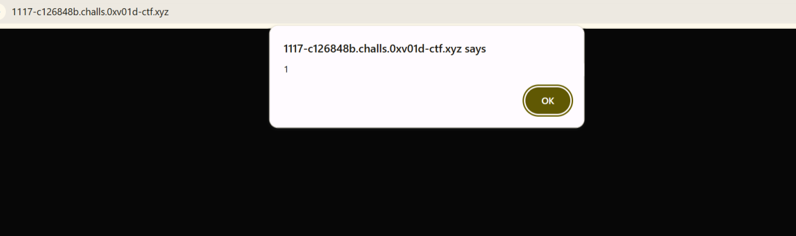

# Challenge Overview
Name: Neon Mirage\
Author: 0xV01D Team\
Description: A support preview console tries to keep input harmless while still being useful to operators. Make the interface show what it was not meant to reveal.\
Flag format: 0xV10D{...}\
Objective: Nhập js expression đúng sẽ hiển thị FLAG
# Solution Plan
Trước hết cần hiểu js expression là gì ? . nó là một đoạn code js mà khi chạy sẽ tạo ra một giá trị
1. Kiểm tra các kí tự như  `' " ; \ / > < ` bị block. Kiểm tra hàm có sẵn  thì có response chú ý là `the filter names dangerous functions, but JavaScript objects still remember who built them `
2. Khi có thông tin đó ta sẽ hàm `constructor()` vẫn có thể thực thi. 
3. Gửi payload trả về alert(1) `[].constructor.constructor(alert(1))()`. Payload sẽ thực thực hiện: tạo một mảng rỗng bằng constructor, vì array là một function object nên cần gọi constructor của nó để tạo hàm và hàm này sẽ tạo cảnh báo với dòng message là 1 . Bùm nó đã được thực thi !!

4. Ngay sau đó FLAG cũng được trả về
# Code script
# Flag
`~~0xV01D{b3683d4e-2fee-42e7-94f0-67baf1d05859}~~`
