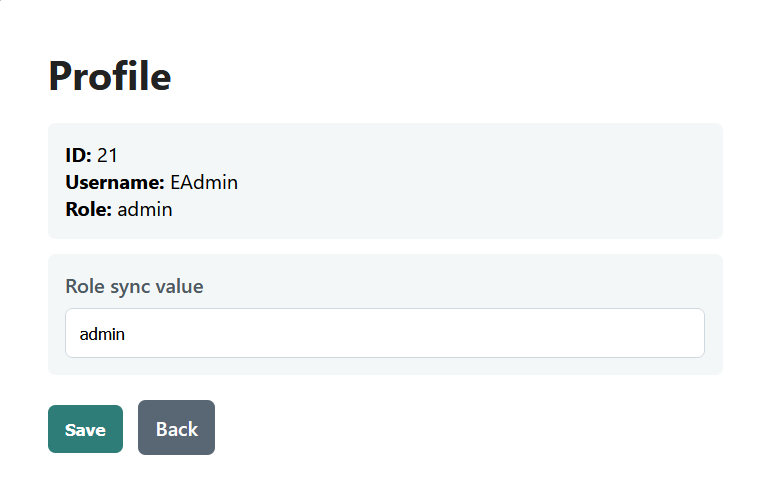

# Challenge Overview
Name: The Altered Grimoire\
Author: 0xV01D Team\
Description: An old vault carries migration scars and a few too many trusted assumptions. Find the path that turns a normal account into something more.\
Flag format: 0xV10D{...}\
Objective: Tìm và đăng nhập tài khoản admin với role admin, sau đó truy cập vào path /admin.php để lấy flag
# Solution Plan
1. Truy cập vào một endpoint bất kì `/gnut ` ở phần `comment` trong source thấy path: `/thjslfgblkf/jdfj546j/kjfhgstnjkn4/users.txt`
 ```yaml
<!--
sometimes paths are not written as they appear...
think in segments, not full routes
/thjslfgblkf/jdfj546j/kjfhgstnjkn4/users.txt
-->
 ```
2. Truy cập vào path đó để lấy username và password của EAdmin. Do password có 64 kí tự => hash SHA-256, ta crack password 
```
1:!root:df12063dba28f3de6484b024e4aa8cb4dc4b291cc6ed3e5b3c129b015c93ef7c:user
2:$ALOC$:e3d4946c0035bef8f158121298fdafe1cb37df8b71bb6bd50faae9add407ac2c:user
3:$SRV:9bee95b192306ce06a0aaa4c3990a4c20b42c0a5cf8bb2831c8090110bf3a446:user
4:$system:b966e0de428b2b20c9fbd91b7099d327253bae3f93dd2972def2752d1d4adeb1:user
5:(NULL):070562c0d856335a2273773be3b58756168e37ae4971dd4c813bc98bfac06ac0:user
6:(any):c14d69662a25704f3f48b23dec9f63dec224cac0318466fb2590bd8fecf67cd4:user
7:(created):18d7b4eef7a3762bb4493e2c351af60ad21088d31967b8e6033268d796942cc5:user
8:1:34b867036bca9f964dd03e9a047028375481dbfb68e472370380923366815384:user
9:11111111:7017e9fce1cae69237437580745be69f314152da031819f318591dad0b509543:user
10:12.x:39131c26bf265e154bb500c1f3a5ea124caae034a1b3b94cebc1f8939495ec55:user
11:1502:6f6f884a47962127f989a8c9189d88755b6f6e1131989098f41cb6b470276d61:user
12:18140815:36a9637ca2228c97a727d9e156d58f07385ef67e4638f6ee07b62edce3d31ffd:user
13:1nstaller:658ad8e931bac113e4652fee56b25968c92a03df7d4a2f3e9c13049fd638ba2c:user
14:2:7443a295ccc561c01a10659a72d0437d2640911ee9abccd44d5f78f4e1ceb9c4:user
15:22222222:212e5adbcbf28218106cad4eb77b8fc1d37b8c6f662a353c9c4c910778527dcb:user
16:30:f58eb3da115f6fc9bf51456d24ee8b9c36badb66befd109955db316e30f4961f:user
17:31994:7d3faaf3aac76b76177b8efb2cb4c7216ce3fe9d10b8cc284a3abb566f38a89b:user
18:4Dgifts:24e9e693438cd65c5cad6dc316c5ea34c73d04fa9d6fd08bedd7840435834c48:user
19:5:8a5859a2206b8a65ed1d4cb3f411563c4d8e814330b6198ab266f3f5270132d9:user
20:6.x:a25b1df463c8131f076af931db74b28bb4de5b9b7569e59863a316949d0ab8e9:user
21:EAdmin:0e46289032038065916139621039085883773413820991920706299695051332:user
```
3. Đăng nhập với username và password vừa lấy, server có endpoint `/profile?id` để update role => sửa role thành admin


4. Truy cập vào /admin.php ta sẽ lấy được flag
# Code script

# Flag
~~`0xV01D{ace2fb15-1f82-432f-80f8-2193fb08fc99}`~~
