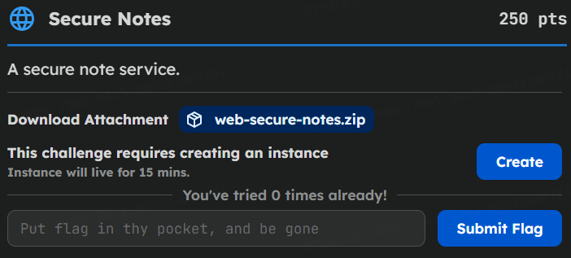
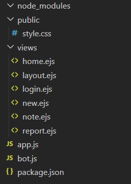
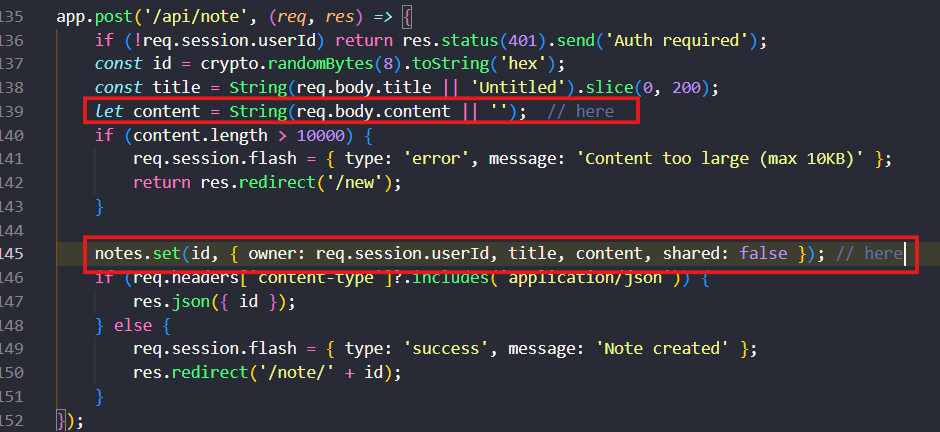
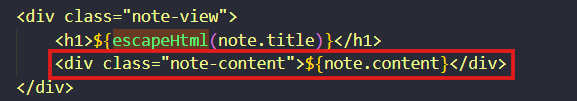
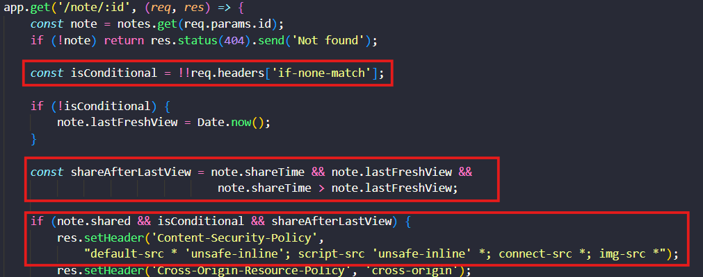
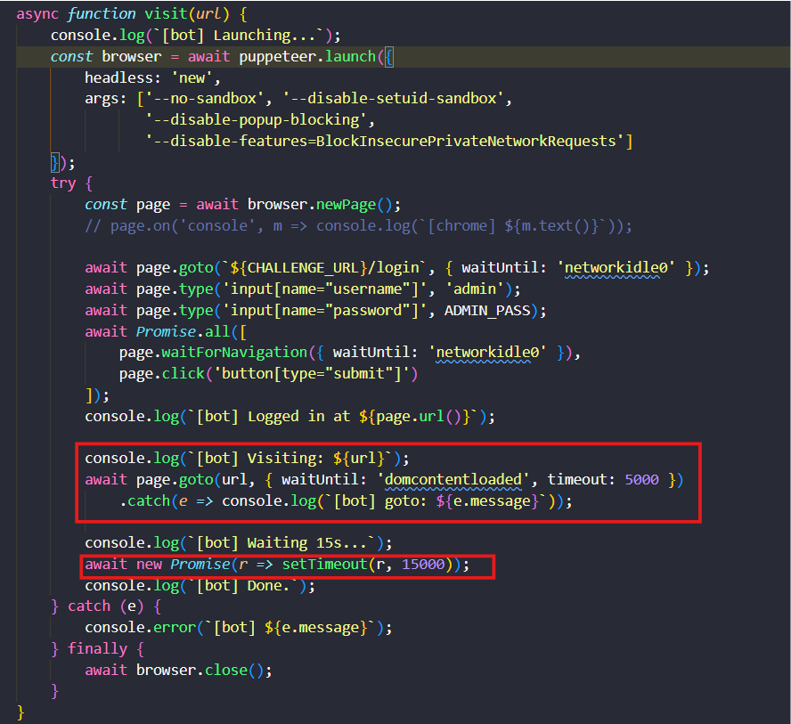
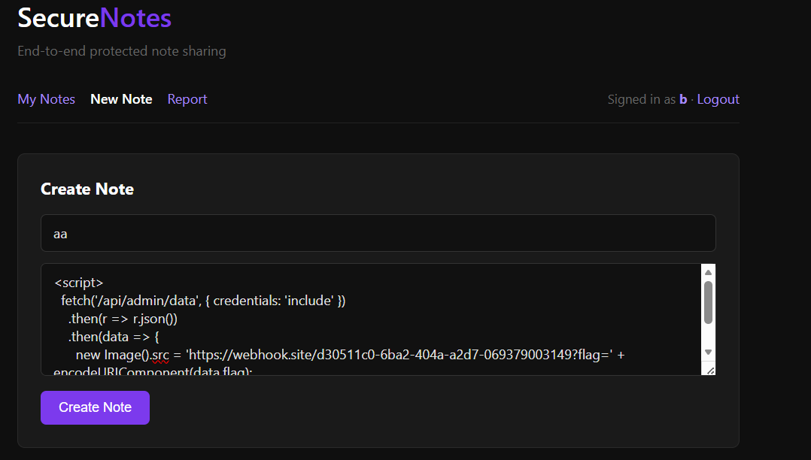
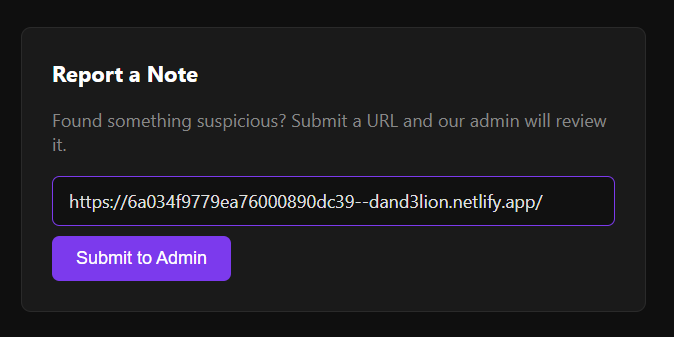

# Overview

Nội dung trong source gồm:


> Chức năng của app: Ứng dụng web cho phép người dùng tạo và chia sẻ các đoạn ghi chú (Note). Ứng dụng cung cấp chức năng Report để báo cáo URL cho Admin (Bot dùng Puppeteer).
> Mục tiêu: Đánh cắp Flag được bảo vệ tại endpoint /api/admin/data, endpoint này yêu cầu quyền Admin (chỉ có Bot mới có Session này).

Chúng ta sẽ đi vào trong code để tìm hiểu cụ thể hơn
# Analysis
1. App.js
  Trong đoạn code `app.js` mình phát hiện tại endpoint `POST /api/note` Content của note  được lưu trữ trong cơ sở dữ liệu và hiển thị dữ liệu đó mà không qua bất cứ bộ lọc nào:
  
  
=> ứng dụng dính lổ hổng `store XSS` ở đây mình có thẻ chèn thẻ <script></script> vào một cách easy 
Tuy nhiên trong enpoint `GET /note/:id` server có thiết lập header Content-security-policy (CSP) để ngăn chặn chạy mã script: 
  ```
  'Content-Security-Policy',`default-src 'self'; script-src 'nonce-${nonce}'
  ```
Mặc dù vậy server cũng đưa ra cách thức để nới lỏng CSP khi:
- Biến `isConditional` trả về true khi request có header `If-none-match`
- Biến `note.shared` true khi note shared
- Biến `shareAfterLastView` true khi thời điểm share được thực hiện trước thời điểm mà xem lần cuối xem note
Khi 3 biến sau trả về True thì CSP sẽ được cập nhật mới làm cho chúng ta chạy được thẻ `<script>`


        
> Mình đã thực hiện theo cách trên: Tạo note sau đó chèn vào content một thẻ `<script>` để thực thi fetch tới endpoint /api/admin/data gửi flag sang webhook của mình sau đó share note và mình đã nhận được phản hồi từ server là admin only(cần session admin) => **mục tiêu tiếp theo là làm thế nào để cho con Bot có session ID truy cập vào được note chứa payload                        

2. Bot.js
 Trong đây bot sẽ được login bằng account của admin. Nó sẽ visit url được lấy từ endpoint `/report`
 . Bot sẽ load url trong vòng tối đa 5s sau đó sẽ truy trì trang trong vòng 15s
 
> Tóm lại: Chúng ta cần xử lí để cho trong vòng 15s Bot truy cập vào note chứa payload
# Attack Scenario
Vì bot không thể share note vì bot không phải owner của note. Vậy nên kịch bản sẽ như sau:

- Attacker: tạo note chứa payload. Xây dựng trang exploi có hành vi tự động xảy ra khi bot truy cập vào trang web (chúng ta có thể tạo code và hosting bằng netlify)
  



- Bot: Mở trang mới bằng `windown.open` truy cập vào note để lưu giá trị `LastFreshView`. Trình duyệt Bot sẽ lưu HTML và Etag vào Cache nội bộ
- Attacker: thực hiện share note đó ngay để giá trị `shareTime > lastFreshView`
- Bot: sau vài giây bot sẽ truy cập lại vào note đó . do trùng URL và có `Cache-Control: no-store` nên trình duyệt Bot phải xác thực bằng việc gửi header `if-none-match` kèm etag. Server sẽ phản hồi `304 not modified`, CSP được cập nhật(nới lỏng) và `conten-type: text/html` được dữ nguyên
=> khi payload trong note được thực thi, chúng ta sẽ lấy được flag
Flag: ~~BKISC{I_th0ught_I_w4s_s3cur3_but_chr0me_1s_4lw4ys_s0m3thing_n3w_b751dcd092f9}~~
