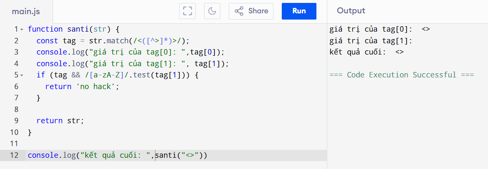
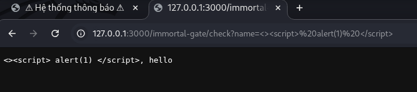
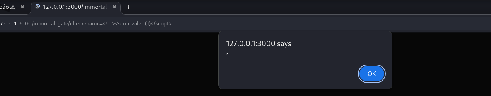
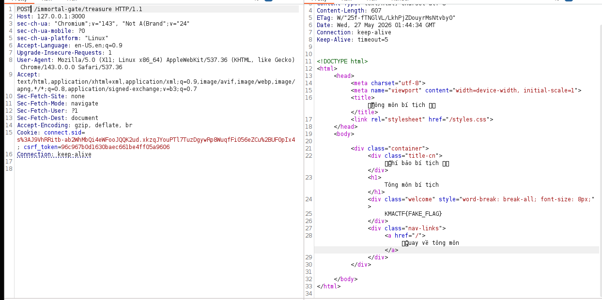

# Challeange overview
Name: CHATGPT MADE ME DO IT
Author: nigh7c0r3\
Description: I asked ChatGPT for help, and it... well, you'll see.\
Object: Khai thác lỗ hổng XSS để khôi phục password ADMIN
# Analysis
Cấu trúc thư mục:
```text
public/

│  .dockerignore
│  docker-compose.yml
│  Dockerfile
│   
└──deploy
    │  app.js
    │  bot.js
    │  config.js
    │  middleware.js
    │  package.json
    │  routes.js
    │  utils.js
    │   
    ├──public
    │   styles.css
    │       
    └──views
        templates.js
```
Mình sẽ tập trung vào các file: app.js , bot.js , router.js , middleware.js

app.js:
APP lấy các PORT, SESSION_SECRET từ file config.js và sử dụng csrfprotection từ file middleware.js . Cookie mà app sử dụng có các thuộc tính quan trọng như httponly:true và samesite:strict => js trên trình duyệt không đọc được cookie và chặn gửi cookie trong request cross-site
=> Qua những thông tin trên mình đoán là khả năng lỗ hổng csrf rất khó xảy ra

middleware.s:
Trong này có func `csrfprotection()` nó sẽ thực hiện kiểm tra header `Sec-Fetch-Site != 'undefined'` và `Sec-Fetch-User != '?1' ` để đảm bảo các request điều hướng là do hành động trực tiếp từ người dùng thực hiện
=> điều này có thể khẳng địch là lỗ hổng csrf rất khó

bot.js:
Bot được đăng nhập bằng account ADMIN và truy cập url do client cung cấp. Bot sẽ hoạt động tối đa là 5s.
=> Gợi ý tận dụng quyền admin để thực hiện khai thác

Router.js:
Mình nhận thấy các endpoint quan trọng sau:
`/immortal-gate/treasure` endpoint này sẽ trả FLAG nếu HTTP method là POST, username = admin
`/immortal-gate/report` cho phép nhập url dạng http or https cho bot visit
`/immortal-gate/check` dùng để kiểm `name` bằng function `santi()` sau đó in chuỗi {name},hello ra màn hình
`/cultivation/password` xác thực session và header x-csrf-token=csrf_token sau đó sẽ đổi password của user hiện tại thành rỗng

`function Santi()` Sử dụng regex để lấy các kí tự bên trong `<>` nếu bên trong <> gồm các kí tự [a-zA-Z] sẽ phản hồi `no hack` sau đó return str
=> mục đích là filter nếu chèn thẻ `<script>`

Sau khi phân tích mình thấy khả năng CSRF để lấy flag từ endpoint /immortal-gate/treasure không thể thực hiện. Mình chuyển sang việc bypass func Santi() để thực hiện XSS ở endpoint `/immortal-gate/check`. Bởi vì Santi() chỉ kiểm tra tag[1] vậy nên mình chèn payload như sau:
`<>` : sử dụng <> để bypass 


Tiếp đến mình sẽ chèn `<><script>alert(1)</script>` để xem đoạn js có được chạy hay không



đoạn js không chạy. mình tìm hiểu thì biết được cho cơ chế parse của browser:
+ Dựa vào Content-Type của response trước 
+ Browser có thể MIME sniff. Cụ thể là sẽ dựa vào cấu trúc nội dung để xác định kiểu

Mình sủ dụng cơ chế thứ 2 để tiêm vào payload: `<!--><script>alert(1)</script>`. `<!-->` là thẻ comment trong html và không chứa các kí tự [a-zA-Z]


Thật tốt!!. Mình đã thực hiện bypass thành công và khai thác được lỗ hổng XSS qua /immortal-gate/check. Tiếp theo mình sẽ xây dựng kịch bản để lấy flag

# Solution Plan
1. Do bot được đăng nhập bằng account ADMIN vậy nên cần tạo payload truy cập vào /cultivation/password để thay đổi password. Payload cần đáp ứng có header x-csrf-token= csrf_token:
```js
document.cookie='csrf_token=abc; path=/cultivation';
fetch('/cultivation/password',{
  method:'GET',
  headers:{'X-CSRF-Token':'abc'}
})`
```

2. Đầu tiên  sử dụng enpoint `/immortal-gate/report` để bot visit `http://localhost:3000/immortal-gate/check ` sau đó chèn thêm `?name=payload`
. Sau khi gửi bot sẽ truy cập `http://localhost:3000/immortal-gate/check` và sẽ thực hiện đoạn payload js ngay tại request gốc để kèm cookie. Khi đó password của admin đã được đổi thành `rỗng`
3. Truy cập endpoint `/immortal-gate/treasure` với method POST và ta sẽ nhận được flag. 



Do mình chạy local để làm nên kết quả flag sẽ như vậy

