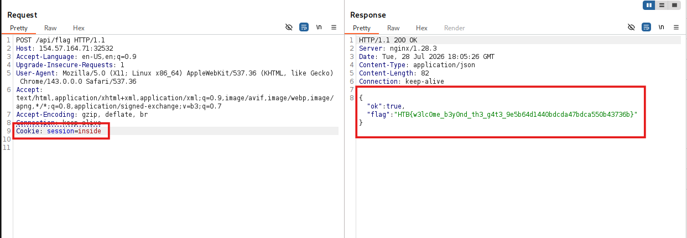

# Tổng quan
Mô tả: Lysa Harrowmere reaches Crownspire with proof that a trusted castle informant is selling patrol routes to the enemy. The information is being used to ambush messengers, delay supplies, and keep Stormbound’s allies divided. The only person who can act on the proof is inside the castle for a closed council, but Lysa’s name has been removed from the entry list and the guards have orders to admit no unscheduled visitors. If she waits, the council ends and the traitor disappears with the next route packet. If she speaks openly at the gate, the proof is seized before it reaches the right hands. Lysa must trick the guarded passage, get inside, and place the evidence with the one ally who can expose the leak before the enemy moves again.\
Cấu trúc thư mục: 
```text
\---challenge
    |   .gitignore
    |   docker-compose.yml
    |   Dockerfile
    |   flag.txt
    |   
    +---app
    |   |   index.ts
    |   |   package.json
    |   |   vite.config.ts
    |   |   
    |   \---client
    |       |   index.html
    |       |   
    |       +---public
    |       |   \---assets
    |       |       +---css
    |       |       |       .gitkeep
    |       |       |       
    |       |       +---img
    |       |       |       castle-gate-closed.png
    |       |       |       castle-gate-open.png
    |       |       |       castle-interior-background.png
    |       |       |       gate-guardian-spritesheet.png
    |       |       |       medieval-castle-loop.mp3
    |       |       |       player-lyra-spritesheet.png
    |       |       |       town-npcs-spritesheet.png
    |       |       |       
    |       |       \---js
    |       |               .gitkeep
    |       |               
    |       \---src
    |               App.jsx
    |               main.jsx
    |               styles.css
    |               
    \---config
            nginx.conf
            supervisord.conf
```
# Phân tích
Đầu tiên, mình xác định các endpoints trong challenge bao gồm:
- /api/login: 
- /api/me
- /api/logout
- /api/gate/open
- /api/gate/enter
- /api/flag
Vì mục tiêu là lấy flag mình sẽ phân tích code xử lý bên trong endpoint /api/flag:
```ts
  .post('/api/flag', ({ cookie: { session }, set }) => {
    if (!session.value) {
      set.status = 401
      return { ok: false, message: 'Login required' }
    }

    if (session.value !== 'inside') {
      set.status = 403
      return { ok: false, message: 'Enter the castle first' }
    }

    return { ok: true, flag }
  })
```
Endpoints này được gọi bằng method `POST` và nhận giá trị `session` của cookie để kiểm tra. Nó sẽ kiểm tra session tồn tại và `value= inside`. Nếu cả 2 điều kiện thỏa mãn thì sẽ trả về flag.
# Kế hoạch khai thác
Mình sẽ tạo ra cookie với `Name= session` và `value= inside`. Sau đó sẽ gửi request `POST` kèm cookie trên tới `/api/flag`

Flag: ~~`HTB{w3lc0me_b3y0nd_th3_g4t3_9e5b64d1440bdcda47bdca550b43736b}`~~